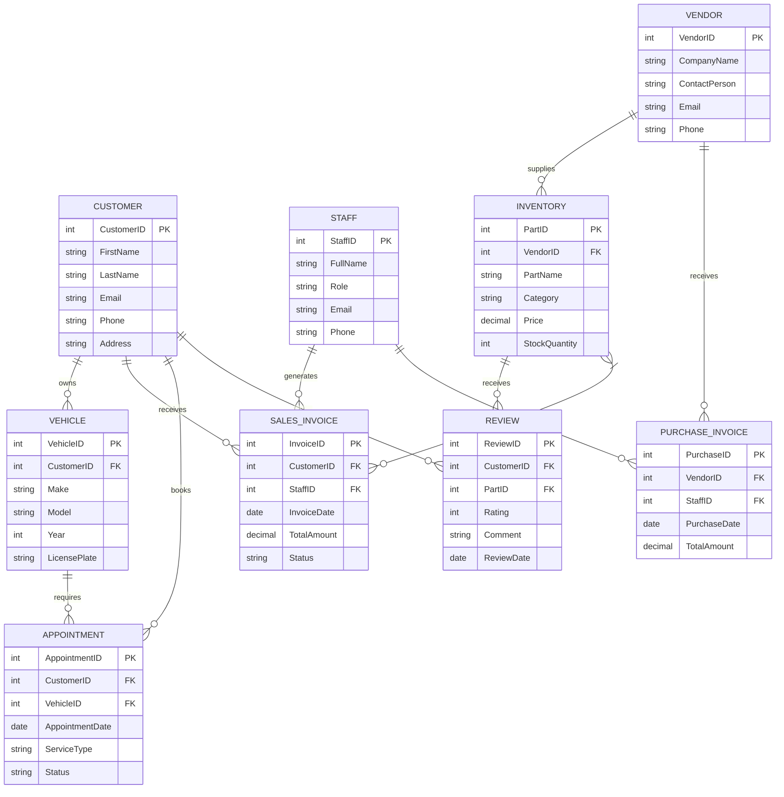
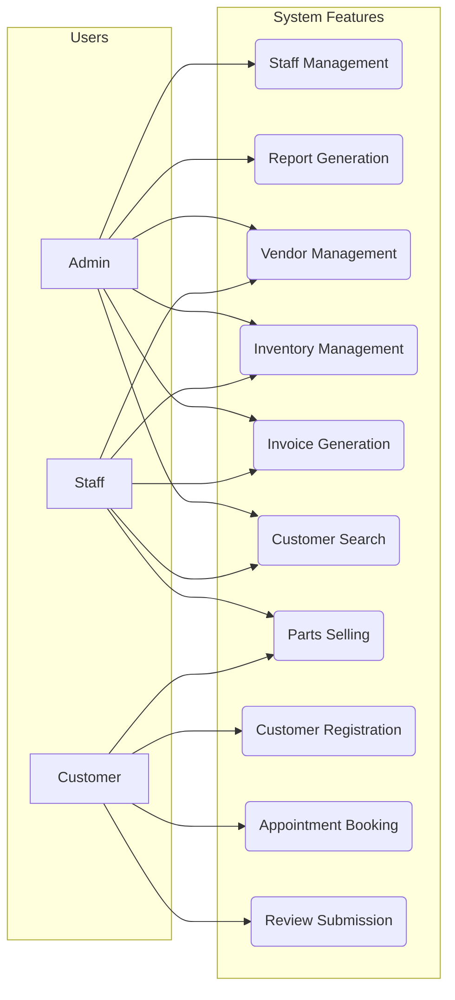
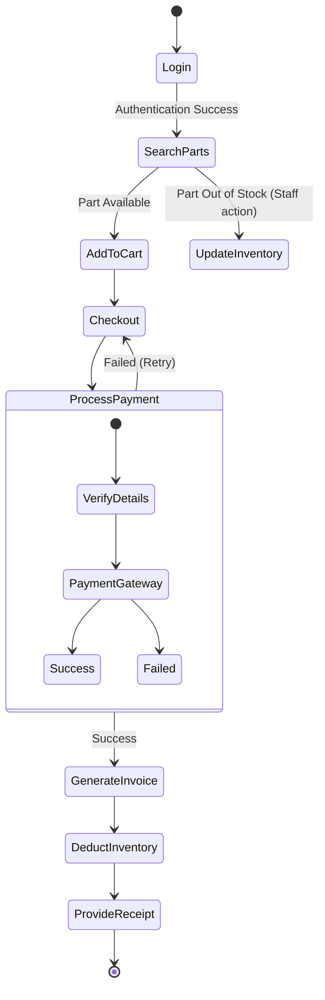
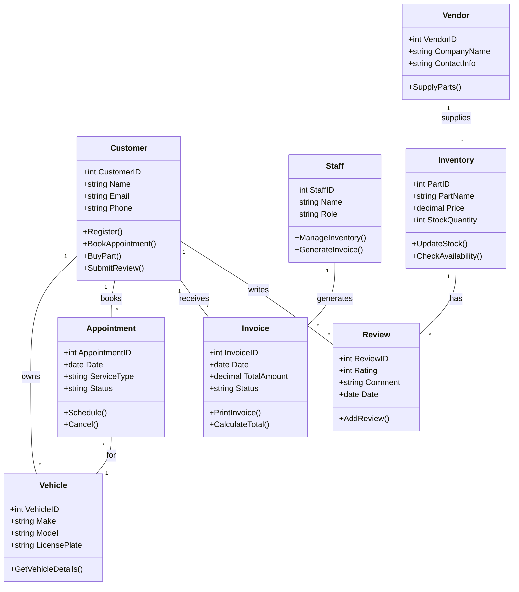

# System Diagrams - Mermaid Code

You can copy and paste these codes into the [Mermaid Live Editor](https://mermaid.live/) to generate images (PNG/SVG) which you can then download and insert into your Word document.

---

## 1.1 ER Diagram (Entity Relationship Diagram)



---

## 1.2 Use Case Diagram

```mermaid
usecaseDiagram
    actor Admin
    actor Staff
    actor Customer

    package "Vehicle Parts & Inventory System" {
        usecase "Staff Management" as UC1
        usecase "Report Generation" as UC2
        usecase "Vendor Management" as UC3
        usecase "Inventory Management" as UC4
        usecase "Invoice Generation" as UC5
        usecase "Customer Search" as UC6
        usecase "Parts Selling" as UC7
        usecase "Customer Registration" as UC8
        usecase "Appointment Booking" as UC9
        usecase "Review Submission" as UC10
    }

    Admin --> UC1
    Admin --> UC2
    Admin --> UC3
    Admin --> UC4
    Admin --> UC5
    Admin --> UC6

    Staff --> UC3
    Staff --> UC4
    Staff --> UC5
    Staff --> UC6
    Staff --> UC7

    Customer --> UC7
    Customer --> UC8
    Customer --> UC9
    Customer --> UC10
```
*(Note: If your mermaid viewer doesn't support the experimental `usecaseDiagram`, you can use this alternative standard graph format which works everywhere):*


---

## 1.3 Activity Diagram (Vehicle Parts Selling & Invoice Process)



---

## 1.4 Class Diagram


